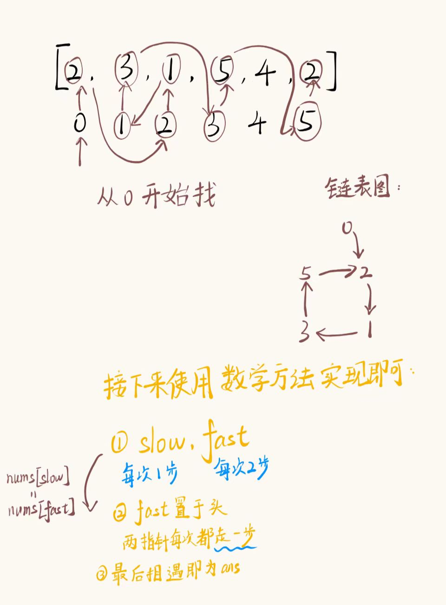
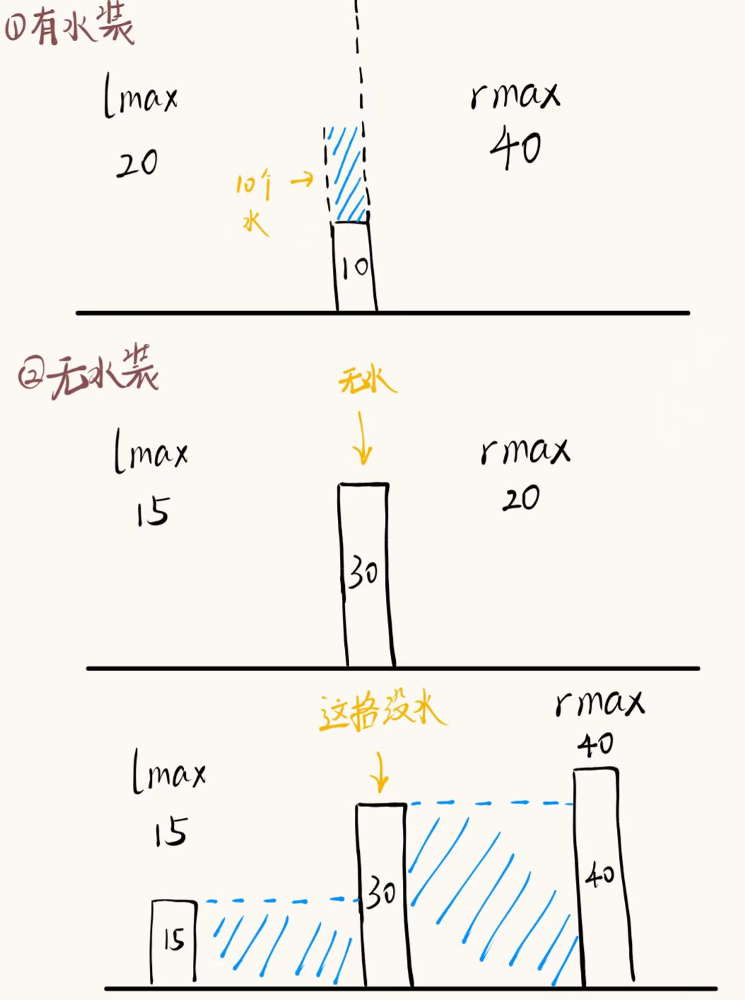
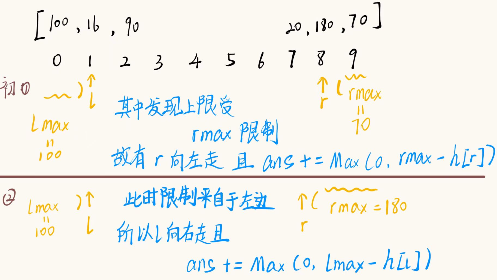

# 双指针
#### 前置知识：
* 无

### 基本信息：
其实双指针这个技巧，说法很宽泛，**似乎**没什么总结。
* 有时候双指针的技巧就是单纯代码用双指针的形式表达出来而已
* 有时候的双指针技巧包含**单调性（贪心）方面**的考虑，牵扯到取舍的可能性<br>对分析能力要求变高。其实是**先有的思考和优化**，然后代码变成了**双指针**。
* 双指针这个“皮”不总要，**分析题目单调性（贪心）方面的特征**，这个能力才是重要的

### 常见双指针类型：
* 同向双指针
* 快慢双指针
* 从两头往中间的双指针
* 其他

### 比较重要的题目：
* [寻找重复数](#寻找重复数)
* [接雨水](#接雨水)
* [供暖器](#供暖器)

### 题目：
* [按奇偶排序数组II](https://leetcode.cn/problems/sort-array-by-parity-ii/)
    * **题意：** 题目要求是将所有数字归位 奇数位是奇数，偶数位是偶数
    * **暴力解：** 开辟两个数组 分别为奇偶 遍历一次 nums 将奇数和偶数分别放入奇偶两个数组中 然后遍历数组安排位置即可
    * **优化：** 题目信息中说：奇偶各占一半 会发现 只要是奇偶之间 其中一个满足了题意 那么 另一半就会已经归位好了 这个时候就可以使用双指针优化
    * **代码：**
    ```cpp
    class Solution {
        void swap(int& a, int& b) 
        {
            int tmp = a;
            a = b;
            b = tmp;
        }
    public:
        vector<int> sortArrayByParityII(vector<int>& nums) {
            int n = nums.size(), odd = 1, even = 0;
            int last = n - 1;   //尾部指针
            while (odd < n && even < n)
            {
                if (nums[last] % 2)
                {
                    //这个是奇数
                    swap(nums[odd], nums[last]);
                    odd += 2;
                }
                else
                {
                    //这个是偶数
                    swap(nums[even], nums[last]);
                    even += 2;
                }
            }
            return nums;
        }
    };
    ```
<br>
<a id="寻找重复数"> </a>

* [寻找重复数](https://leetcode.cn/problems/find-the-duplicate-number/)
    * **题意：** 在n+1个范围[1, n]内的数，找到重复的数字<br>**要求：** 解决方案必须**不修改**数组 nums 且只用**常量级** O(1) 的**额外空间**
    * **暴力：** 使用 l，r 指针，每次从 l 开始遍历数组，r 指针去扫描，发现相同则返回，否则 l 前进，r 再继续从 l 开始扫描。
    * **优化：** 不妨回忆下**链表**中寻找成**环**节点的**第一个**节点<br>将数组中数组的元素作为链表的next。
    
    * **代码：**
    ```cpp
    class Solution {
    public:
        int findDuplicate(vector<int>& nums) {
            int slow = nums[0];
            int fast = nums[nums[0]];
            do {
                slow = nums[slow];
                fast = nums[nums[fast]];
            } while (slow != fast);
    
            fast = 0;
    
            while (slow != fast) {
                slow = nums[slow];
                fast = nums[fast];
            }
    
            return slow;
        }
    };
    ```
<br>
<a id="接雨水"> </a>

* [接雨水（⭐）](https://leetcode.cn/problems/trapping-rain-water/)
    * **题意：** 示例：<br>输入：height = [0,1,0,2,1,0,1,3,2,1,2,1]<br>输出：6
    
    * **分析：** <br>首先画图分析，发现第 i 格能装水需要<b>Min（lmax, rmax）> height[i]</b>，其余情况均是无法装水的
    
    * **解法①：辅助数组**
    1. 创建一个辅助数组 lmax[n]，rmax[n]，分别记录 i 左边和右边的最大高度
    2. 创建一个变量 ans = 0，用于记录结果
    3. 遍历数组 ans += Max(0, Min(lmax[i], rmax[i]) - height[i])
    <br>
    * **解法②：双指针**
        * 分析： 通过第一种辅助数组中 可以发现是 限制是来自于 两则之间的最小高度 那么我们就可以通过画图分析 如下图所示：
    
    * **双指针解法代码：**
    ```cpp
    class Solution {
        static int Max(int a, int b) { return a > b ? a : b; }
    public:
        int trap(vector<int>& height) {
            int n = height.size();
            int ans = 0, l = 1, r = n - 2, 
            lmax = height[0], rmax = height[n - 1];
            while (l <= r)
            {
                if (lmax > rmax)
                {
                    //说明此时限制来自右边
                    ans += Max(0, rmax - height[r]);
                    rmax = Max(rmax, height[r--]);
                }
                else
                {
                    //说明此时限制来自左边
                    ans += Max(0, lmax - height[l]);
                    lmax = Max(lmax, height[l++]);
                }
            }
            return ans;
        }
    };
    ```
<br>

* [救生艇](https://leetcode.cn/problems/boats-to-save-people/)
    * **我的分析：** 这一题很明显的一个贪心，**现有**people中<b>people[l] + people[r] <= limit</b>这个条件满足，就说明船还可以承载两个人，若是出现**不满足**，那么接下来**所有**的船只都只能承载一个人。
    * **解题思路：** <br>
    1. 先对people进行**升序排序**
    2. 创建两个指针 l 和 r，l 指向最轻的，r 指向最重的
    3. 判断peolpe[l] + people[r] <= limit，若是满足，则 l++，r--，并 ans++
    4. 若是不满足 r--, ans++
    * **PS：** 我的思路和标准双指针思路是一样的<br>只不过有更优解 但不是双指针的解法
    * **代码：**
    ```cpp
    class Solution {
    public:
        int numRescueBoats(vector<int>& people, int limit) {
            sort(people.begin(), people.end());
            int l = 0, r = people.size() - 1, ans = 0;
            while (l <= r)
            {
                if (people[l] + people[r] <= limit)
                    l++, r--;
                else
                    r--;
                ans++;
            }
            return ans;
        }
    };
    ```
<br>

* [盛水最多的容器](https://leetcode.cn/problems/container-with-most-water/)
    * **分析：** 首先观察题目 会发现这题**和接雨水类似** 同样是**受着两则最小的那一边的限制** 所以可以采用类似的双指针解法（属于**接雨水的简单版**）
    * **思路：** <br>
    1. 令 l = 0, r = n - 1，初始时，l 和 r 分别指向数组的两端。
    2. 循环：当 l < r 时，执行以下操作：
    3. 计算两个指针之间的距离，记为 d = r - l。
    4. ans = Max(ans, d * Min(height[l], height[r]))
    5. 如果 height[l] < height[r]，则 l++；否则，r--。
    * **代码：**
    ```cpp
    class Solution {
        inline static int Max(int a, int b) { return a > b ? a : b; }
        inline static int Min(int a, int b) { return a < b ? a : b; }
    public:
        int maxArea(vector<int>& height) {
            int l = 0, r = height.size() - 1, ans = 0, d;
            while (l < r)
            {
                d = r - l;
                ans = Max(ans, Min(height[l], height[r]) * d);
                if (height[l] > height[r])
                    r--;
                else
                    l++;
            }
            return ans;
        }
    };
    ```
<br>
<a id="供暖器"></a>

* [供暖器](https://leetcode.cn/problems/heaters/)
